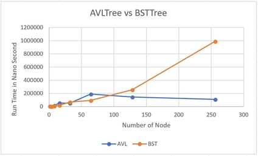

# Project 2 (uMessage) Write-Up #
--------

## Project Enjoyment ##
- What was your favorite part of the project? Why?
  <pre>Our favorite part was trying to not sure pre-defined java and the process of trying to think around it</pre>

- What was your least favorite part of the project? Why?
  <pre>Debugging AVL Tree was the hardest thing. I believe because there were limited amount of things we can do to debugging. 
  For example we can not print inside the program to check what is going on</pre>

- How could the project be improved? Why?
  <pre>It would be great if there is a way to help us debugging although I believe something like that will be hard to make</pre>

- Did you enjoy the project?  Why or why not?
  <pre>Yes and No. Thinking about how it works was fun was the debugging following that was not really enjoyable</pre>
    
-----

## Experiments ##
Throughout p1 and p2, you have written (or used) several distinct implementations of the Dictionary interface:
 - HashTrieMap 
 - MoveToFrontList
 - BinarySearchTree
 - AVLTree
 - ChainingHashTable
 
 In this Write-Up, you will compare various aspects of these data structures.  This will take a significant amount of
 time, and you should not leave it to the last minute.  For each experiment, we expect you to:
 - Explain how you constructed the inputs to make your conclusions
 - Explain why your data supports your conclusions
 - Explain your methodology (e.g., if we wanted to re-run your experiment, we would be able to)
 - Include the inputs themselves in the experiments folder
 - Include your data either directly in the write-up or in the experiments folder
 - You should include graphs of the outputs for at least a few of the questions.
   You can add a link to an image following the instructions found here:
https://courses.cs.washington.edu/courses/cse332/18su/handouts/markdown.pdf
An example can also be found at the end of this file.
 - We recommend that you keep your "N" (as in "N-gram") constant throughout these experiments. (N = 2 and N = 3 are reasonable.) 
 - You should probably run multiple trials for each data point to help remove outliers.
 - You should not need to wait for hours and hours for your program to run in
 order to answer a question.  Do use large values for N, but not so large that 
 you are waiting overnight for your program to run (N=1,000,000 is likely larger 
 than you need.).

### BST vs. AVLTree ###
Construct inputs for BST and AVLTree to demonstrate that an AVL Tree is asymptotically better
than a Binary Search Tree. Comparing the worst case for each structure is fine here. 
To do this, we expect you to show trends.  You might consider fitting a curve to
your results. Explain your intuition on why your results are what they are.
<pre>
   I decided to test and compare the worst case insert run time for BST and AVLtree.
Although I can test both find and insert, because insert itself is using a very similar algorithm to 
find insert location on the tree, testing only insert should be enough to test which tree is 
asymptotically better.First the worst case for BST is when the key of the key value pair keeps getting
bigger so it basically becomes a linked list. For AVLTree because no matter where you insert the rebalance is
a constant time as far as we are evoking it to rebalance every time, we are making it go through the worst case.
Second, I wanted to know how long it takes to insert different numbers of node in both trees.</pre>

<pre>
     To implement this, I wrote BSTvsAVL.java. I inserted a key with increasing natural number (1,2,3¡¦) in 
both trees so it will only stack to the right side and mock the worst case. After inserted some nodes 
I rerun the same test while increasing the amount of node I insert each time to see which tree performs  
better as more and more nodes are being inserted. Finally, I ran the same test 5 times as throw out  
the shortest and longest run time and took the average of the rest to eliminate weird cases.</pre>

<pre>
     The graph above shows the result of the test with each vertex and graph labels. As each trees are  
given more input nodes AVLtree becomes asymptotically faster. This is because while BST has to traverse  
all the nodes when it inserts because it becomes basically like a linked it, AVLtree does not have to  
because it balances the tree every time. However, for a small section, when there is small amount of node,  
BTS is slightly faster because the time going through all the nodes is faster than re-balancing.  
But of course, this is only possible when there are very small number of nodes. This graph support what  
I expected and learned in class because it does show the AVLtree is more efficient when there are large 
amount of data.</pre>

### ChainingHashTable ###
Your ChainingHashTable should take as an argument to its constructor the type of "chains" it uses.  Determine
which type of chain is (on average, not worst case) best: an MTFList, a BST, or an AVL Tree.  Explain your intuition on why
the answer you got makes sense (or doesn't!). 
<pre>
	To test the efficiency of each chain used in ChainingHashTable, we used the insert and iterator methods of ChainingHashTable.  Both insert and iterator method were tested on ChainingHashTables with different input numbers. This was done to test the  performance of different chains under incremented stress. Then the iterator was used to traverse all of the elements and call  HashCode (a relatively cost-less function) on each element. This was done to measure the average performance of each chain;  basic traversal of the chain is rather basic and important in performance. </pre>
	
<pre>
	As you can see in the graph above, in both lower volume inputs and higher volume inputs for insert, MTFList performs the worst,  BST performs second best, and AVLTree performs the best. This is due to the nature of AVLTrees which balances the right and  left subtrees thus the insert method will never run on the worst possible case of BSTTree. Thus AVLTree is faster than BSTTree on  insert. BSTTree must be faster than MTFList since MTF has a linked list implementation. All elements added to the MTF is moved  to the front, thus the head node must change with every insert, making it slower. This explains the speed order for insert. Now  for the iteration. AVLTree is the fastest, BSTTree is the second fastest, and MTF is the slowest. The speed of iteration  between AVLTree and BSTTree is same as insert: balanced subtrees make iteration faster. MTF is a linked list thus iteration means  going through all elements one by one, making it O(n), thus slowest. Conclusion: AVL tree is the best! </pre>
 
### Hash Functions ###
Write a new hash function (it doesn't have to be any good, but remember to include the code in your repository).
Compare the runtime of your ChainingHashTable when the hash function is varied.  How big of a difference can the
hash function make (on average, not worst case)?  (You should keep all other inputs (e.g., the chain type) constant.)  Explain your intuition on why your results are what they are.
<pre>
   In order to start this question, I started with building CircularArrayFIFOQueue2 that is identical to CircularArrayFIFOQueue but
will a new hascode that should give less variation. In the test I created two identical list of CircularArrayFIFOQueue and
CircularArrayFIFOQueue2 with each element have the same data. After that I inserted the list in to two different ChainingHashTable
one using CircularArrayFIFOQueue as a key and other one using CircularArrayFIFOQueue2 as a key. I tested this same thing with
different number of inputs. I did this same thing 5 times and record the average of middle 3 values to throw away any unexpected
values. Although I only testing inserting, because find also uses a very similar algorithm of looking for the node and instead of
inserting the key value pair it looks for it. So it should give us the same result.
	For convenience I will call ChainingHashTable that uses CircularArrayFIFOQueue as A and ChainingHashTable
that uses CircularArrayFIFOQueue2 as B. I expected A will have a better run time than B because it will have less conflict when being 
inserted. This was pretty obvious.
				run time
Number of Element	goodHashCHT  	 badHashCHT
1	                10406	         1710
10	                94368	         41910
100	                1348675	         5494484
1000	            	2506188	         90610809
10000	            	36506446	 6040725099
</pre>

<pre>
     Above is the data table I got after running the test. It was surprising because under 100 elements B was actually faster.
 I believe this is because how CircularArrayFIFOQueue hashcode runs. The hashcode actaully goes through all the element to create a 
 more unique hashcode based on the element and CircularArrayFIFOQueue2 hashcode just returns the size. Because CircularArrayFIFOQueue
 hashcode takes much longer, if there are under 100 element being added to A and B, creating hashcode for each CircularArrayFIFOQueue 
 overpowers the time of chaining them. However, as the number of element being inserted becomes bigger you 
can see that the  
difference grows. So in conclusion, we can benefit from more diverse and well written hashcode.
</pre>

### General Purpose Dictionary ###
Compare BST, AVLTree, ChainingHashTable, and HashTrieMap on alice.txt.  Is
there a clear winner?  Why or why not?  Is the winner surprising to you?
<pre>
	There is somewhat a clear winner. Both BST and TrieMap took over 10 times longer than AVLTree and HashTable to read in alice.txt,  thus both BST and TrieMap are out of consideration. Now, AVL tree and HashTable differed about 10000000ms, which isn't really  much but still, AVL tree was faster. The huge difference between AVLTree/HashTable and BST/HashMap could be explained via their  worst cases. AVLTree and HashTable both have a great worst case scenario, AVLTree has balanced subtrees and HashTable manages  duplicative keys with chains (buckets). Thus both AVLTree and HashTable takes much less than O(n) time to fully operate. BST is  slower than AVL like explained above due to the possible imbalance of subtrees but it is also slower than HashTable because of  the nature of handling duplicate keys. BST must traverse longer than the HashTable to handle duplicate keys, thus must be  slower. TrieMap using MTF dictionary is also slow because, like explained above, MTF is a slow method compared to BST and AVLTree.  A clear winner can't really be determined between the AVLTree and HashTable as they both carry a specific strength when it  comes down to different types of input. When there are much more duplicate keys, HashTable will be stronger, but in other cases  AVLTree will be stronger. Thus AVLTree and HashTable are both winners!</pre>

-----

## Above and Beyond ##
-   Did you do any Above and Beyond?  Describe exactly what you implemented.
 <pre>
 	Nope.</pre>