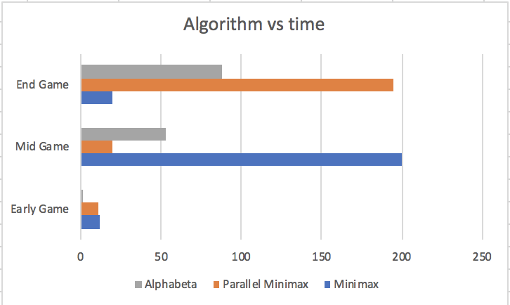

# Project 3 (Chess) Write-Up #
--------

## Project Enjoyment ##
- How Was Your Partnership?
  <pre>It was good we were able to help each other understanding the question and debug</pre>
  
- What was your favorite part of the project?
  <pre>Trying to understand the question was hard but fun at the same time becuase it was a very new concept personally</pre>

- What was your least favorite part of the project?
  <pre>Debugging parallel minimax and alpha beta was really hard</pre>

- How could the project be improved?
  <pre></pre>

- Did you enjoy the project?
  <pre>Yes and No it was challenging</pre>
    
-----

## Experiments ##

### Chess Game ###

#### Hypotheses ####
Suppose your bot goes 3-ply deep.  How many game tree nodes do you think
it explores (we're looking for an order of magnitude) if:
 - ...you're using minimax?
    <pre>I believe minimax actually looks at every possible branch when calculating the nodes, unless we are in a incheck position. 
    According to the homework handout, an average chess position has 35 possible moves so after 3-ply deep, it will have looked at 35^3 nodes.  </pre>
 - ...you're using alphabeta?
    <pre>In alphabeta it is hard to tell because each position is going to be different, because we do know when we will be able to disregard the branch. 
    So all I can do is approximate. I believe maybe visiting half of the nodes and disregarding the other half might be reasonable each time we go down the tree
    so maybe close to 17^3.</pre>

#### Results ####
Run an experiment to determine the actual answers for the above.  To run
the experiment, do the following:
1. Run SimpleSearcher against AlphaBetaSearcher and capture the board
   states (fens) during the game.  To do this, you'll want to use code
   similar to the code in the testing folder.
2. Now that you have a list of fens, you can run each bot on each of them
   sequentially.  You'll want to slightly edit your algorithm to record the
   number of nodes you visit along the way.
3. Run the same experiment for 1, 2, 3, 4, and 5 ply. And with all three
   implementations (use ply/2 for the cut-off for the parallel
   implementation).  Make a pretty graph of your results (link to it from
   here) and fill in the table here as well:

|      Algorithm     | 1-ply | 2-ply | 3-ply |  4-ply  |   5-ply   |
| :----------------: |:-----:|:-----:|:-----:|:-------:|:---------:|
|       Minimax      |  29   | 1111  | 30296 | 1098626 | 298832341 |
|  Parallel Minimax  |  29   | 1111  | 30296 | 1098626 | 298832341 |
|      Alphabeta     |  29   | 407   | 7467  | 66126   | 403766    |

#### Conclusions ####
How close were your estimates to the actual values?  Did you find any
entry in the table surprising?  Based ONLY on this table, do you feel
like there is a substantial difference between the three algorithms?
<pre>Nothing was really surprising. As expected Minimax and Parallel Minimax had the same node count because they are essentially doing the same thing one in parallel 
one in sequentially. I was kind of guessing that Alphabeta will be looking at half amount of node that Minimax is looking at however the difference was bigger. I was
somewhat surprised by the big difference. That means the Alphabeta was able to eliminate a lot of options. So this means that there are a big difference between normal
and Alphabeta. </pre>

### Optimizing Experiments ###
THE EXPERIMENTS IN THIS SECTION WILL TAKE A LONG TIME TO RUN. 

#### Generating A Sample Of Games ####
Because chess games are very different at the beginning, middle,
and end, you should choose the starting board, a board around the middle
of a game, and a board about 5 moves from the end of the game.  The exact boards
you choose don't matter (although, you shouldn't choose a board already in
checkmate), but they should be different.

#### Sequential Cut-Offs ####
Experimentally determine the best sequential cut-off for your
parallel mini-max searcher.  You should test this at depth 5.  
Plot your results and discuss which cut-offs work the best on each of
your three boards.
<pre>
Simply put, the best cutoff for:
SimpleSearcher -> 1 (Do all sequential work)
AlphaBetaSearcher -> 5 (Do all recursive work)
ParallelSearcher -> 3 (Do balance amount of sequential and parallel work).
The ParallelSearcher returns an interesting result. 0 and 5 are the
worst cases, this may be due to performing only via sequential or
only via parallelism. This tends to be slow. 2 and 4 have almost the same time value and 3 is a tiny tiny bit faster than 2 and 4. So the more balanced the parallel and sequential works are, the faster it is.
</pre>

#### Comparing The Algorithms ####
Now that you have found an optimal cut-off, 
you should compare the actual run times of your four implementations. 
At depth 5, using your optimal 
cut-offs, time all three of your algorithms
for each of the three boards.

Plot your results and discuss anything surprising about your results here.
<pre>
AlphaBetaSearcher
CutOff: 0
92768156057 = 92.77 seconds
CutOff: 1
89055264652 = 89.06 seconds
CutOff: 2
89210118086 = 89.21 seconds
CutOff: 3
89429196997 = 89.43 seconds
CutOff: 4
89122383284 = 89.12 seconds
CutOff: 5
88993647365 = 89.00 seconds
Best: 5
For early game, it took about 265362209 to complete.
For mid game, it took about 53571028199 to complete.
For late game, it took about 88993647365 to complete.

SimpleSearcher
CutOff: 0
202820546863 = 202.82 seconds
CutOff: 1
201177070146 = 201.18 seconds
CutOff: 2
201267352162 = 201.28 seconds
CutOff: 3
203010772669 = 203.01 seconds
CutOff: 4
201623110495 = 201.62 seconds
CutOff: 5
201332518878 = 201.33 seconds
Best: 1
For early game, it took about 12090521705 to complete.
For mid game, it took about 201177070146 to complete.
For late game, it took about 20639241428 to complete.

ParallelSearcher
CutOff: 0
387681928080 = 388 seconds
CutOff: 1
280273467521 = 280 seconds
CutOff: 2
195045814187 = 195 seconds
CutOff: 3
194960336795 = 194.9 seconds
CutOff: 4
199306307775 = 199 seconds
CutOff: 5
210869877880 = 211 seconds
Best: 3
For early game, it took about 11470693181 to complete.
For mid game, it took about 19883561822 to complete.
For late game, it took about 194960336795 to complete.

AlphaBata Searcher shows really nice results for earlier games. This
maybe due to the number of branches and thus the pruning algorithm is much simplified in the earlier stages rather than later ones.
SimpleSearcher and ParallelSearcher both show a linear increment of play time from early game to late game, and at the very final stage of late game, the play time is decreased by a little (this is due to game ending). 
It is noticeable that at the best cutoff, ParallelSearcher is a bit faster than SimpleSearcher and at any other cases, SimpleSearcher is more consistent and faster.
</pre>

|      Algorithm     | Early Game |  Mid Game |  End Game |
| :----------------: |:----------:|:---------:|:---------:|
|       Minimax      | 12 seconds |200 seconds|20 seconds |
|  Parallel Minimax  | 11 seconds |20 seconds |195 seconds|
|      Alphabeta     | 0.26 second|53 seconds |88 seconds |

### Beating Traffic ###
In the last part of the project, you made a very small modification to your bot
to solve a new problem.  We'd like you to think a bit more about the 
formalization of the traffic problem as a graph in this question.  
- To use Minimax to solve this problem, we had to represent it as a game. In
  particular, the "states" of the game were "stretches of road" and the valid
  moves were choices of other adjacent "stretches of road".  The traffic and
  distance were factored in using the evaluation function.  If you wanted to use
  Dijkstra's Algorithm to solve this problem instead of Minimax, how would you
  formulate it as a graph?
  <pre>For me it was easier to think of this problem in terms of graph and use Dijkstra's Algorithm. Wherever a diver has to make a choice between more than one road,
  that would be a node and different roads they can take will be edge and the weight will be the time it takes to go between two nodes. This time will take everything in 
  to consideration such as traffic and distance</pre>

- These two algorithms DO NOT optimize for the same thing.  (If they did,
  Dijkstra's is always faster; so, there would be no reason to ever use
  Minimax.)  Describe the difference in what each of the algorithms is
  optimizing for.  When will they output different paths?
  <pre>So the Dijkstra's Algorithm and minmax to very different things.
  The biggest difference is what they look at. Dijkstra's Algorithm looks at the time and tried to minimize the time that it would cost to go from point A to B.
  However, Minimax tries to minimize the traffic that one has to go through, so it is not necessarily the fastest path.  
  This can result it two different result when there is two path to A to B where one is straight but very traffic heavy and one goes around but is less traffic heavy.
  Dijkstra's Algorithm will give you the straight path while Minimax will give you the around path. </pre>